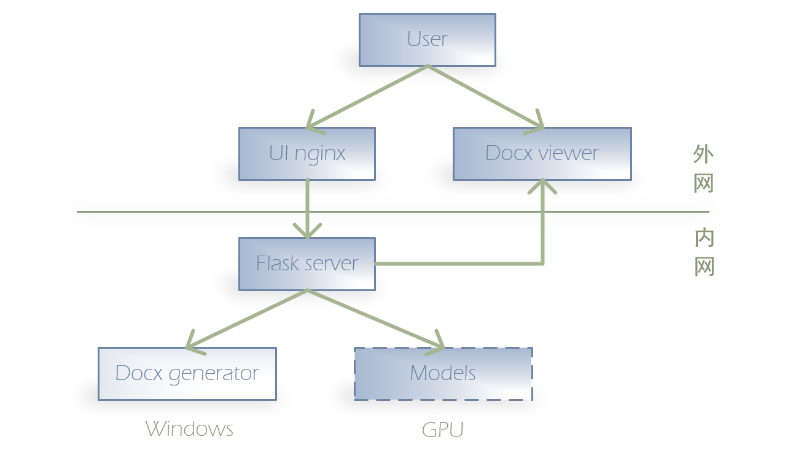

# ai-reporter

## Architecture

1. 图中UI nginx和Docx Viewer组件需要对外提供服务。
2. Flask Server、Ningx、Docx Viewer组件可以部署在linux机器上
3. Docx generator组件需要部署在windows环境下
4. GPU服务可以没有，在没有的情况下，需要使用外部的RAG源。需要两个API，一个是chat completions另一个是RAG对话接口。

## Environments

1. 中资（生产环境）

   | 服务   | URL                                                  | 描述               | 备注               |
   | ------ | ---------------------------------------------------- | ------------------ | ------------------ |
   | 万物   | http://kd.21vianet.com/largeModelApplication/#/aiApp | 快搭万物大模型地址 | 报告助手           |
   | UI     | http://120.133.63.166:9001/#/chat                    | 前端入口           | Yi-34B             |
   | Server | http://127.0.0.1:5001                                | 后端入口           | 部署在A800服务器上 |
   | 模型   | 8000、8001、8002                                     | A800               |                    |

   

2. 中资RAG（生产环境）

   | 服务   | URL                                                          | 描述               | 备注               |
   | ------ | ------------------------------------------------------------ | ------------------ | ------------------ |
   | 万物   | http://kd.21vianet.com/largeModelApplication/#/aiApp         | 快搭万物大模型地址 | 报告助手RAG        |
   | UI     | http://120.133.63.166:9003/#/chat                            | 前端入口           |                    |
   | Server | http://127.0.0.1:5003                                        | 后端入口           | 部署在A800服务器上 |
   | 模型   | Yi-34B-Chat  http://120.133.83.228:28002/v1/chat/completions（暂时使用8003替换） http://120.133.83.136:11017/api/v1/chat/completions | 国产服务器上Yi-34B | 使用华为910B服务器 |

   

3. 中资RAG-Langchain（生产环境）

   | 服务   | URL                                                          | 描述               | 备注               |
   | ------ | ------------------------------------------------------------ | ------------------ | ------------------ |
   | UI     | http://120.133.63.166:9004/#/chat                            | 前端入口           |                    |
   | Server | http://127.0.0.1:5004                                        | 后端入口           | 部署在A800服务器上 |
   | 模型   | 8004                                            | A800               |                    |

   

4. Test（程序员开发使用）

   | 服务   | URL                              | 描述     | 备注 |
   | ------ | -------------------------------- | -------- | ---- |
   | UI     | http://172.22.220.20:9001/#/chat | UI入口   |      |
   | Server | http://172.22.220.21:5001        | 服务入口 |      |
   | Model  |                                  | 模型     |      |

   

5. 内网（生产环境）

   | 服务   | URL                                                   | 描述               | 备注               |
   | ------ | ----------------------------------------------------- | ------------------ | ------------------ |
   | 万物   | http://dcom.21vianet.com/largeModelApplication#/aiApp | 内网万物大模型入口 |                    |
   | UI     | http://120.133.63.166:9002/#/chat                     | 前端入口           | Yi-34B             |
   | Server | http://127.0.0.1:5002                                 | 后台入口           | 部署在A800服务器上 |
   | Models |                                                       | 模型               | 与中资共享         |

   

6. 微调（测试环境）

   | 服务   | URL                                                   | 描述               | 备注               |
   | ------ | ----------------------------------------------------- | ------------------ | ------------------ |
   | 万物   | http://dcom.21vianet.com/largeModelApplication#/aiApp | 内网万物大模型入口 |                    |
   | UI     | http://120.133.63.166:9006/#/chat                     | 前端入口           | Yi-34B             |
   | Server | http://127.0.0.1:5006                                 | 后台入口           | 部署在A800服务器上 |
   | Models | 8006                                                  | 模型               | 与中资共享         |
   

